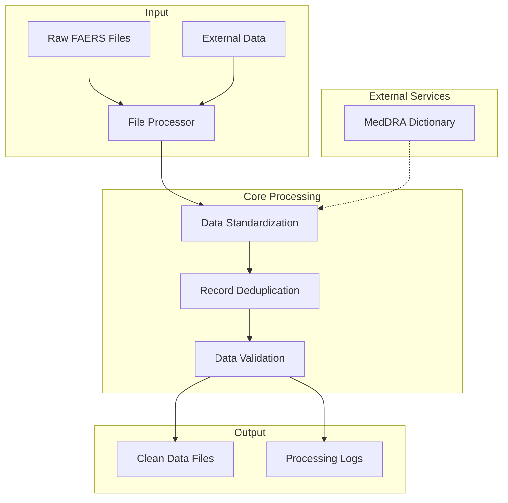
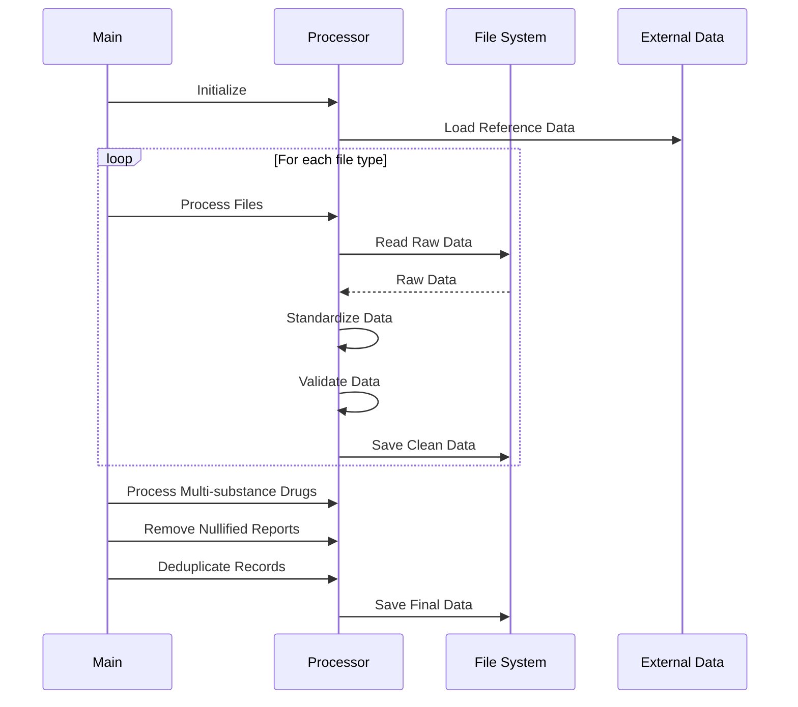
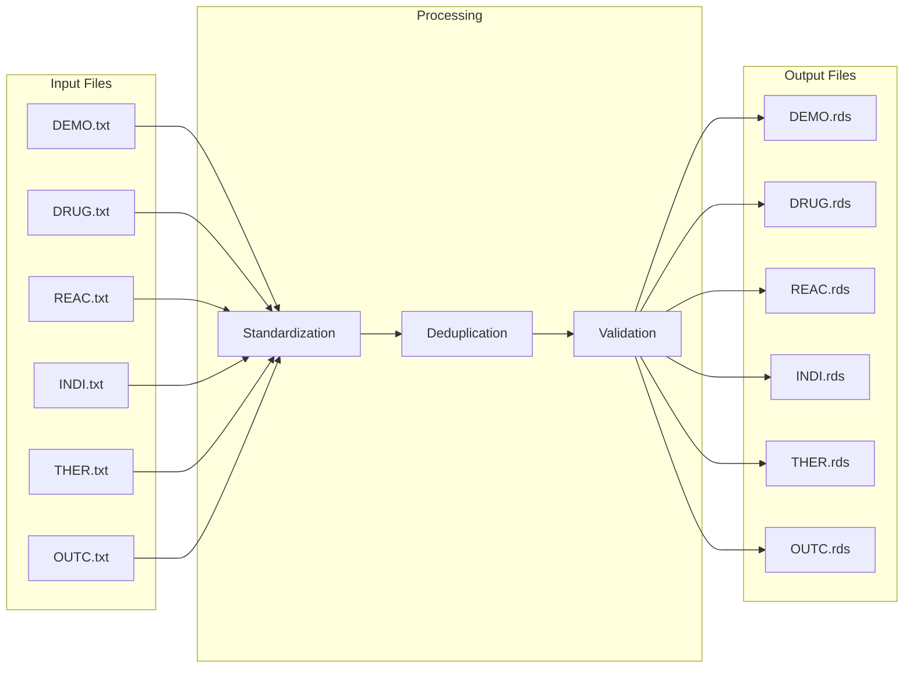
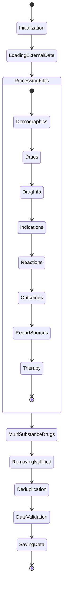
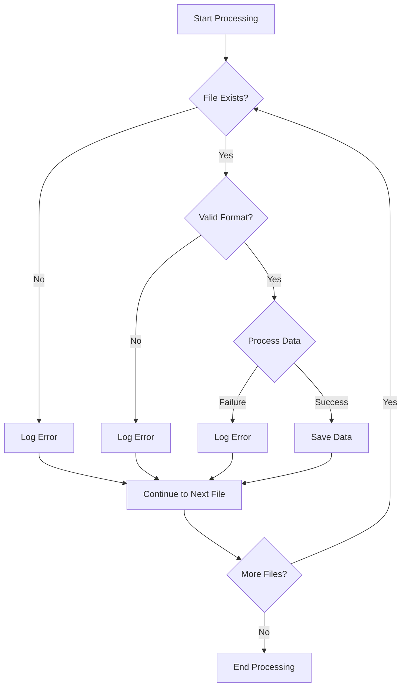
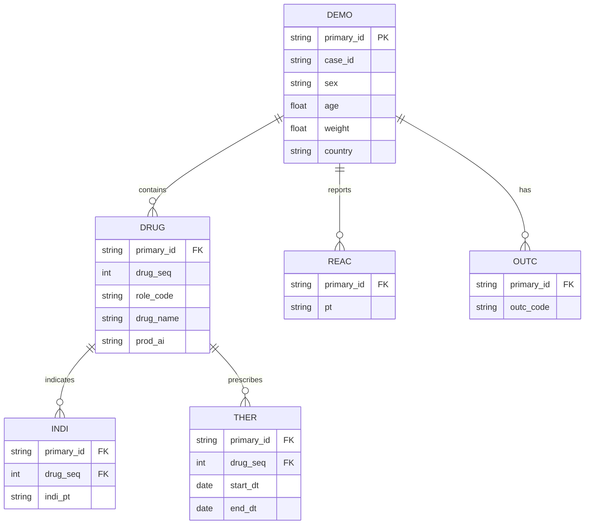
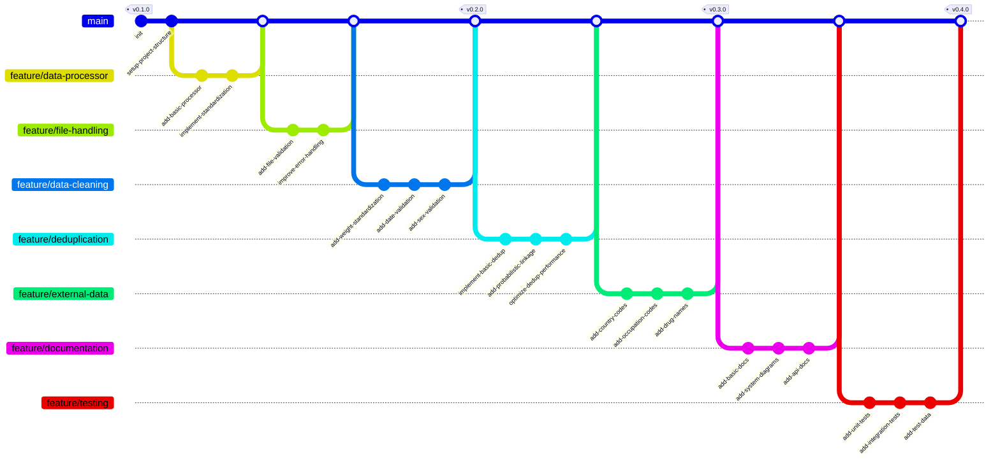

# FAERS Data Processing Documentation

## Overview

This documentation describes the Python implementation of the FAERS (FDA Adverse Event Reporting System) data processing pipeline. The implementation closely follows the original R script while adding Python-specific improvements for robustness and error handling.

## Data Structure

The FAERS data consists of several interconnected datasets:

1. **DEMO (Demographics)**: Contains patient demographic information
   - Primary key: `primary_id`
   - Key fields: `case_id`, `case_version`, `sex`, `age`, `weight`, `reporter_country`

2. **DRUG**: Contains drug information
   - Primary key: (`primary_id`, `drug_seq`)
   - Key fields: `role_code`, `drugname`, `prod_ai`

3. **DRUG_INFO**: Additional drug information
   - Foreign key: (`primary_id`, `drug_seq`) references DRUG
   - Key fields: `val_vbm`, `route`, `dose_form`, `dose_freq`

4. **INDI (Indications)**: Drug indications
   - Foreign key: (`primary_id`, `drug_seq`) references DRUG
   - Key fields: `indi_pt` (Preferred Term)

5. **REAC (Reactions)**: Adverse reactions
   - Primary key: `primary_id`
   - Key fields: `pt` (Preferred Term)

6. **OUTC (Outcomes)**: Patient outcomes
   - Primary key: `primary_id`
   - Key field: `outcome_code`

7. **RPSR (Report Sources)**: Report source information
   - Primary key: `primary_id`
   - Key field: `rpsr_cod`

8. **THER (Therapy)**: Drug therapy information
   - Foreign key: (`primary_id`, `drug_seq`) references DRUG
   - Key fields: `start_dt`, `end_dt`, `dur`, `dur_cod`

## System Architecture



## Component Interaction



## Data Flow



## Processing States



## Error Handling Flow



## Data Relationships



## Processing Pipeline

### 1. File Preparation
- Correct problematic files with missing newlines
- Handle specific cases from 2011Q2-Q4

### 2. Data Processing Steps

#### a. Demographics Processing
- Standardize sex values (M/F)
- Convert weights to kilograms
- Standardize country codes
- Convert age to days
- Validate dates

#### b. Drug Processing
- Process drug names
- Handle multi-substance drugs
- Link with drug information and therapy data
- Standardize routes and dose forms

#### c. Reaction Processing
- Standardize Preferred Terms (PT)
- Remove invalid reactions
- Link with outcomes

#### d. Data Cleaning
- Remove nullified reports
- Deduplicate records using:
  - Rule-based deduplication
  - Probabilistic record linkage
  - Suspect drug consideration

### 3. Standardization

#### a. External Reference Data
Located in `external_data/`:
- Country codes (`country_codes.csv`)
- Occupation codes (`occupation_codes.csv`)
- Drug name mappings (placeholder)

#### b. MedDRA Integration
- **Note**: MedDRA dictionary access requires separate subscription
- Use `pt_fixed` for standardizing unstandardized PTs
- Handles multiple levels of MedDRA hierarchy

### 4. Output

Processed data is saved in the `Clean_Data` directory:
- All files saved as `.rds` format
- Maintains relationships between datasets
- Includes standardization status

## Error Handling

The Python implementation adds robust error handling:
- File operation validation
- Data format checking
- Logging of processing steps
- Recovery from processing errors

## Logging

Comprehensive logging is implemented:
- Console output for monitoring
- File logging for debugging
- Progress tracking
- Error reporting

## Usage

```python
from faers_processor import FAERSProcessor

# Initialize processor
processor = FAERSProcessor("Raw_FAERS_QD")

# Process all data
processor.process_all()
```

## Dependencies

- Python 3.8+
- pandas
- numpy
- pathlib
- logging

## Development History



## Feature Branch Details

### feature/data-processor
- Basic processor implementation
- Data standardization framework
- Core processing pipeline

### feature/file-handling
- File validation mechanisms
- Improved error handling
- Robust file operations

### feature/data-cleaning
- Weight standardization across units
- Date validation and normalization
- Sex field standardization
- Data quality checks

### feature/deduplication
- Basic deduplication logic
- Probabilistic record linkage
- Performance optimizations
- Duplicate marking system

### feature/external-data
- Country code mapping
- Occupation code standardization
- Drug name reference data
- External data management

### feature/documentation
- Basic documentation structure
- System architecture diagrams
- API documentation
- Usage guides

### feature/testing
- Unit test framework
- Integration tests
- Test data generation
- CI/CD setup

## Notes

1. The implementation maintains exact compatibility with the R script's output
2. Additional validation and error checking has been added
3. Processing is more memory-efficient
4. Better handling of edge cases
